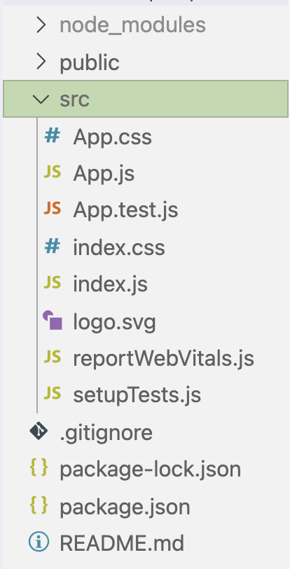
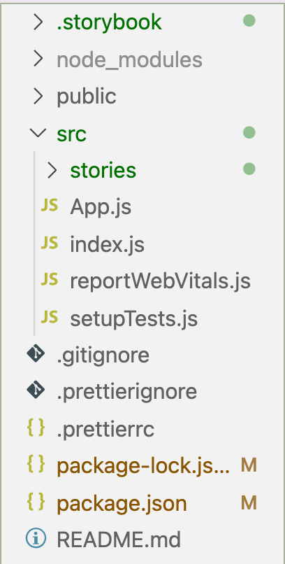
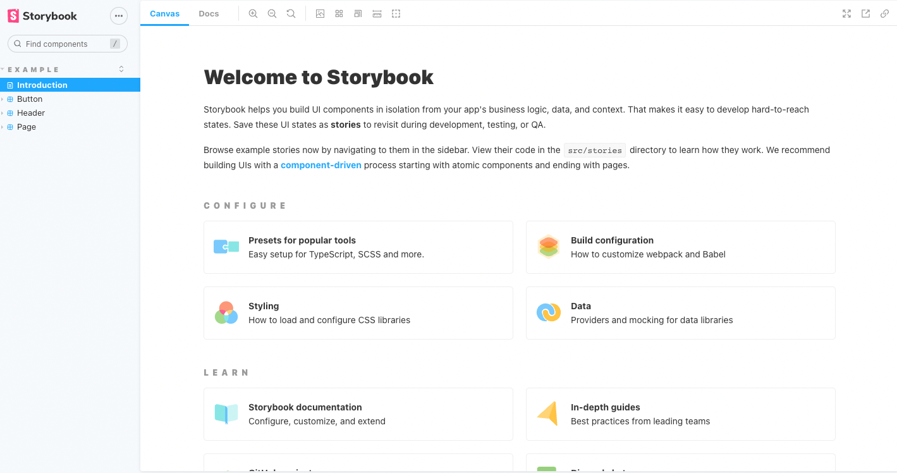

# How to setup and work with storybook

## Step 1 - CRA setup and getting started

First we need to setup a React app. We will use `create-react-app` for it.
Go to your terminal and write:

`npx create-react-app react-storybook-example`

Move into the folder and open it with an editor of your choice - I am using VSCode for it.

`cd react-storybook-example`

The project should look like the following:



Before we get started with storybook, we should do some cleanup. Since we are working with `styled-components`, we won't need th `.css` files anymore.

1. Delete `.css` files and their import
2. Delete `logo.svg` and its import
3. Replace the code in the return statement of the `App.js` with a `<p>Hello World</p>`
4. Install `styled-components`
5. Commit your changes as `Initial setup commit`

Now we are good to go!

## Step 2 - Add storybook

Before we start writing code, we will add storybook to our project. Head back to your terminal, make sure you are in the right working directory and run the following command:

`npx sb init`

_Note: this may take some minutes!_

With this command we are initializing storybook in our project. This command will automatically know that our project is based on React and initialize the right template for us.

Your project structure should look something like this now:



Note the two folders storybook added to our project.

First of all the `.storybook` folder in which you will find the configuration for storybook. If you add something there, you will need to restart storybook before it works.

Secondly, there is a new folder in our `src` folder which is called `stories`. In here you will find some example stories from storybook.

Storybook added two scripts in our `package.json`. One starts the storybook server on `http://localhost:6006` where we can interact with our written stories. The other one builds storybook for deployment.

Let's start storybook and have a look at the interface!

Run `npm run storybook` in your terminal and head to `http://localhost:6006`.

You should see something like this:



Have a look at the `Button` component and its different states. To better undestand what is happening, we will be writing our own first component and a story for it.

## Step 3 - First component

Let storybook continue to run on `http://localhost:6006`.

In your `src` folder, create a new folder `components`.

In this `components` folder, create a `Card.js` file. Add the following code to your file:

```jsx
import styled from 'styled-components/macro'

export default function Card({ title, text, author, color }) {
  return (
    <Wrapper>
      <Title color={color}>{title}</Title>
      <p>{text}</p>
      <small>{author ? author : 'Ananymous'}</small>
    </Wrapper>
  )
}

const Wrapper = styled.section`
  padding: 1rem;
  border: 1px solid black;
  border-radius: 4px;
`

const Title = styled.h2`
  color: ${props => (props.color ? props.color : 'black')};
  font-weight: normal;
  margin: 0;
`
```

To check if the component renders the way we intended it to, we can display it in storybook. To do so we create a new file in the `components` folder: `Cards.stories.js`. Add the following to this file:

```jsx
import Card from './Card'

export default {
  title: 'Component/Card',
  component: Card,
}

const Template = args => <Card {...args} />

export const WithAuthor = Template.bind({})
WithAuthor.args = {
  title: 'Node.js',
  text: 'What is node.js and how to use it?',
  author: 'John Doe',
}
```

Lets dive into what we just did.

1. We import our `Card` component
   1. `import Card from './Card'`
2. We default export metadata about our story so that storybook can list our stories correctly
   1. `export default { title: 'Component/Card', component: Card, }`
   2. Note: that when looking at storybook in the browser, it created a new heading `COMPONENT` and underneath it the `Card` component
3. When a component has different kind of props, we can define a template and which basically allowes us to work with props
   1. `const Template = args => <Card {...args} />`
   2. Note: storybooks doesn't call it `props` but `args` - which is almost the same principle.
   3. Using this template, we can define different states of our `Card` and display them in storybook
4. Next we define a state of our card `export const WithAuthor = Template.bind({})`, with the `.bind({})` we basically say: _"Use the template created before"_
5. We then define the `args` or better props, we want to add to our component - almost like testing!

This is basically all we need to know to write different stories for our components. Each state of our component will be added in our `.stories.js` file.

For example in our `Card` component we have a few props: `{ title, text, author, color }`
And different states!

1. No author is defined: Card will render `Anonymous`
2. Author is definded: Card will render author
3. No color is defined: Title color will be black
4. Color is defined: Title color will be color

**Exercise:**

- Add another state of your `Card` component which is called: `export const WithoutAuthor = Template.bind({})`
- Do the same for `WithColor` and `WithoutColor`
- Remember, you have to define new `args` for each of these differend states/stories!

Once you are done, check out the [solution](solution).

✨ Nice job! You have completed a workflow with storybook! ✨
